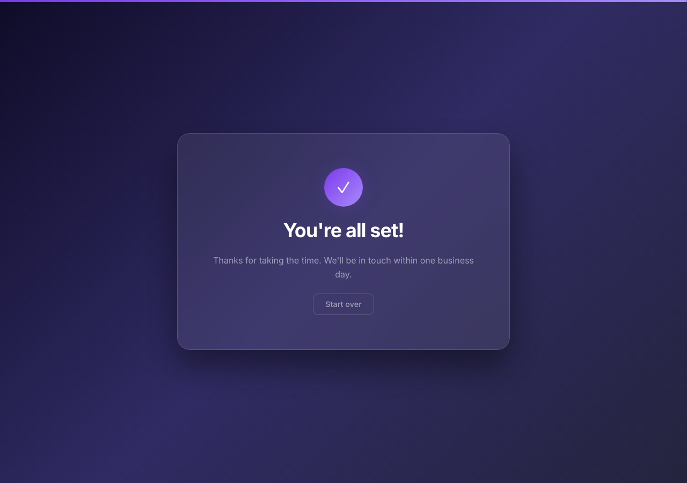

# Playwright Onboarding Form

A Typeform-style multi-step onboarding form — 12 questions, one per screen, smooth slide animations — with full Playwright browser automation and screenshot testing.


---

## Live Demo

> Enable GitHub Pages (Settings → Pages → Source: `main` / `/ (root)`) then update the link:
> **[yourusername.github.io/claude_playwrite](https://yourusername.github.io/claude_playwrite)**



---

## What This Demonstrates

- **Multi-step form UX** — progress bar, keyboard-first navigation (Enter to advance), slide + fade transitions between steps
- **Glassmorphism UI** — `backdrop-filter` blur, CSS custom properties, responsive layout — no framework, no build step
- **Playwright form automation** — filling text inputs, selects, textareas, and date fields programmatically
- **Assertion testing** — verifies the thank-you screen appears and the restart flow works
- **Headless screenshots** — CLI utility for full-page screenshots of any URL
- **Live site scraping** — navigating a real page, extracting text with CSS selectors, and saving a screenshot

---

## Tech Stack

| Layer | Technology |
|---|---|
| Frontend | Vanilla JS (ES6), CSS3, HTML5 |
| Browser automation | Playwright for Python 1.60 |
| Dev server | Python built-in `http.server` |
| Language | Python 3.9+ |

---

## Getting Started

### Prerequisites

- Python 3.9+
- pip

### Install

```bash
pip install -r requirements.txt
python3 -m playwright install chromium
```

### Run the form

```bash
python3 -m http.server 8080
```

Open [http://localhost:8080](http://localhost:8080) in your browser.

### Run the Playwright automation test

With the server running in one terminal, open a second terminal:

```bash
python3 scripts/automate_form.py
```

Fills all 12 form fields in a visible browser window, asserts the thank-you screen, saves `screenshots/form_completed.png`, and verifies the restart flow.

### Take a screenshot of any URL

```bash
python3 scripts/screenshot.py https://example.com screenshots/out.png
```

### Hacker News scraper demo

```bash
python3 scripts/automate.py
```

Navigates to Hacker News, prints the top 10 story titles, and saves a screenshot.

---

## Project Structure

```
├── index.html              # HTML shell
├── styles.css              # Glassmorphism design + slide animations
├── app.js                  # 12-question form logic (vanilla JS, no framework)
├── scripts/
│   ├── automate_form.py    # Playwright test: drives the full onboarding form
│   ├── automate.py         # Demo: scrapes Hacker News in a visible browser
│   └── screenshot.py       # CLI: headless full-page screenshots of any URL
├── screenshots/
│   └── form_completed.png  # Portfolio preview (committed)
├── docs/
│   ├── PROMPTS.md          # Prompt history and development log
│   └── TEST_CASES.md       # 63 one-line test cases for all features
└── requirements.txt
```

---

## Documentation

| File | Description |
|---|---|
| [docs/PROMPTS.md](docs/PROMPTS.md) | Full prompt log — every user prompt, what was built, and the outcome |
| [docs/TEST_CASES.md](docs/TEST_CASES.md) | 63 one-line test cases covering the form, keyboard handling, validation, and all Playwright scripts |

---

## License

MIT
